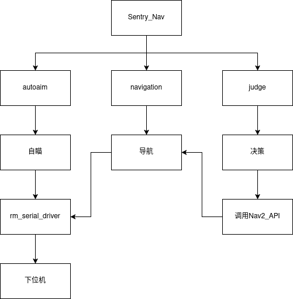

# XTU_Sentry




上位机收发数据格式：
```
struct ReceivePacket
{
  uint8_t header = 0x5A;
  uint8_t detect_color : 1;  // 0-red 1-blue
  uint8_t task_mode : 2;     // 0-手打 1-自瞄 2-大符
  bool reset_tracker : 1;   // 1-重启跟踪器
  uint8_t is_play : 1;      // 1-play 0-stop
  bool change_target : 1;   // 1-change target
  uint8_t reserved : 2;
  float roll;
  float pitch;
  float yaw;
  uint16_t robot_HP;    // 机器人自身血量
  uint16_t game_time;  // (s) game time [0, 450]
  uint16_t checksum = 0;
} __attribute__((packed));


struct SendPacket
{
  uint8_t header = 0xA5;
  uint8_t state : 4;       // 0-untracking 1-tracking-aim 2-tracking-buff
  uint8_t fire_flag : 4;  // 0-fired-off 1-fired-on
  float pitch;
  float yaw;

  float nav_x;
  float nav_y;
  float nav_z;

  uint16_t checksum = 0;
} __attribute__((packed));
```